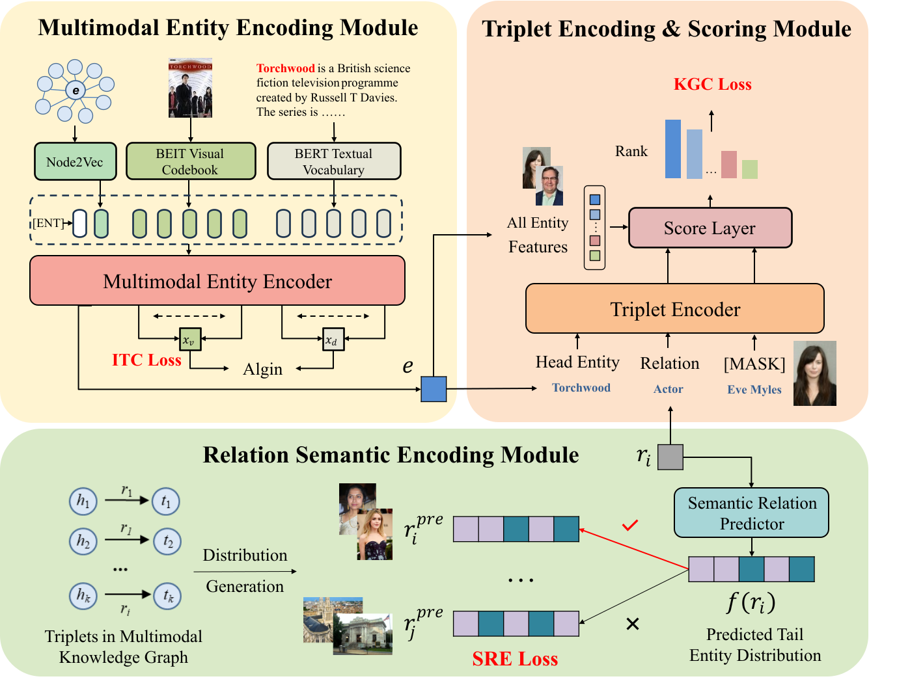

## C2RS: Multimodal Knowledge Graph Completion with Cross-Modal Consistency and Relation Semantics

This is the repository of C2RS: Multimodal Knowledge Graph Completion with Cross-Modal Consistency and Relation Semantics



### Requirements:

```shell
numpy==1.24.2
scikit_learn==1.2.2
torch==2.0.0
tqdm==4.64.1
node2vec==0.4.6 
```

### Download:

DB15K, MKG-W and MKG-Y: https://github.com/quqxui/MMRNS

textual tokens, visual tokens, node2vec tokens and deepwalk tokens：https://pan.baidu.com/s/1dY0HZKc5TQu1KhOGeECt4Q?pwd=hrp7 or https://drive.google.com/file/d/1MMtf43z4wUd_0ZzkXnaEeAhrNTlL9JV-/view?usp=drive_link

### Multimodal Knowledge Graph Completion:

train on DB15K

```shell
sh train_db15k.sh 
```

train on MKG-W

```shell
sh train_mkgw.sh 
```

train on MKG-Y

```shell
sh train_mkgy.sh 
```
